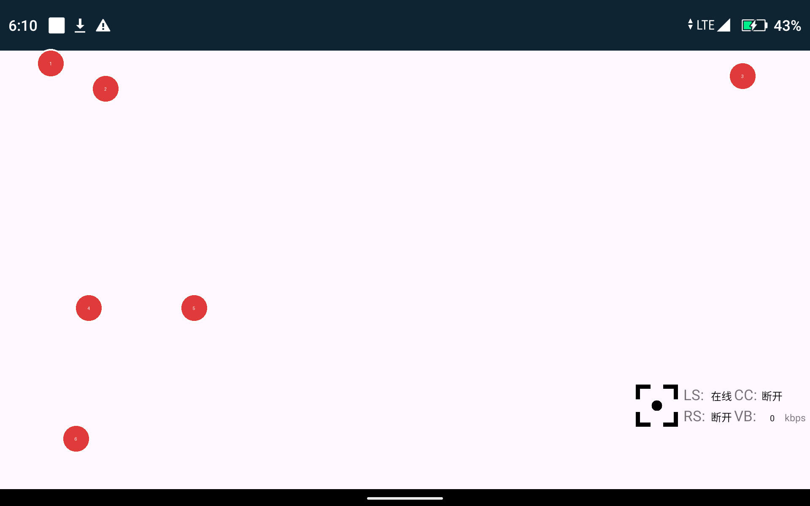
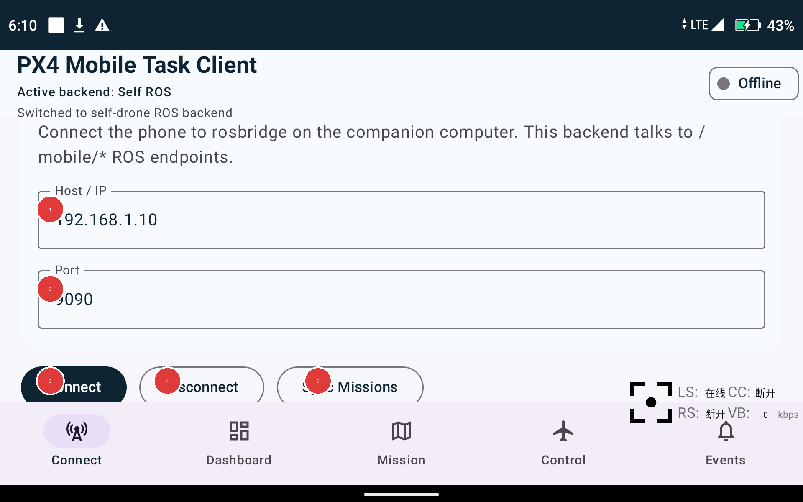
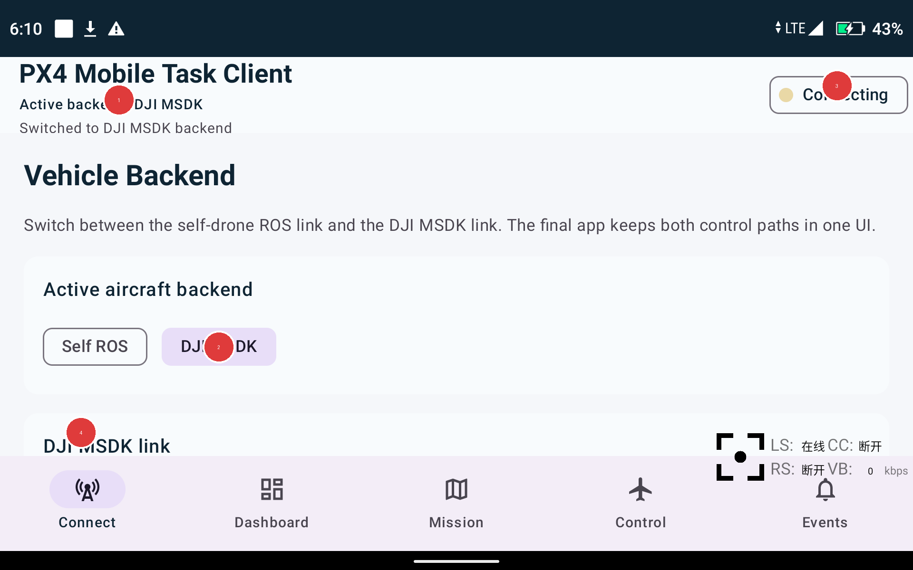
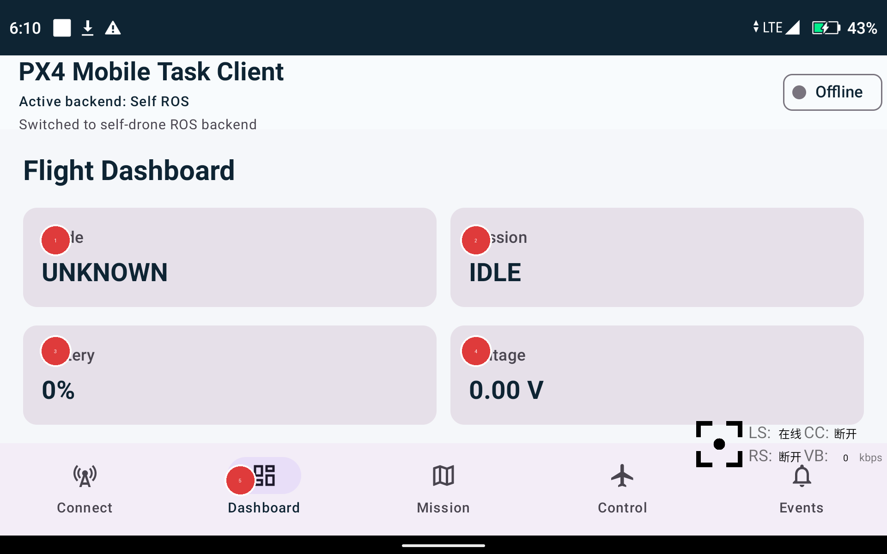
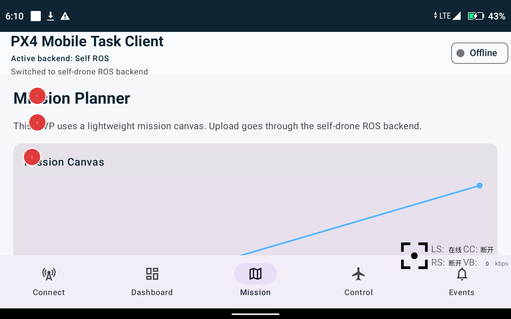
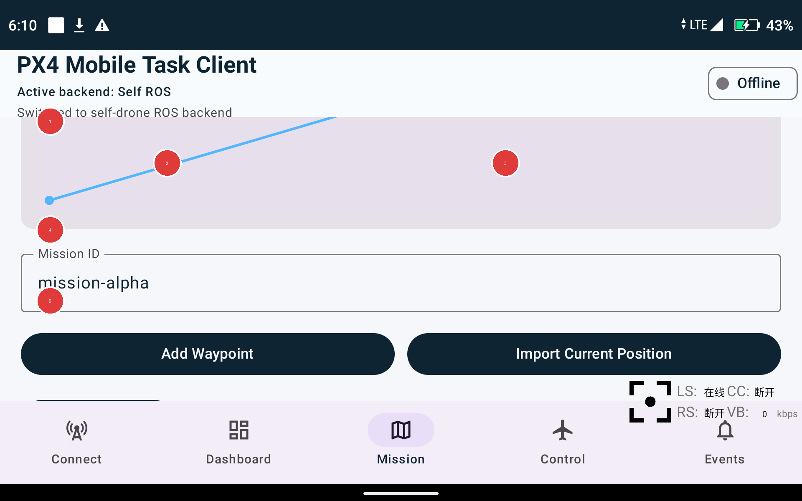
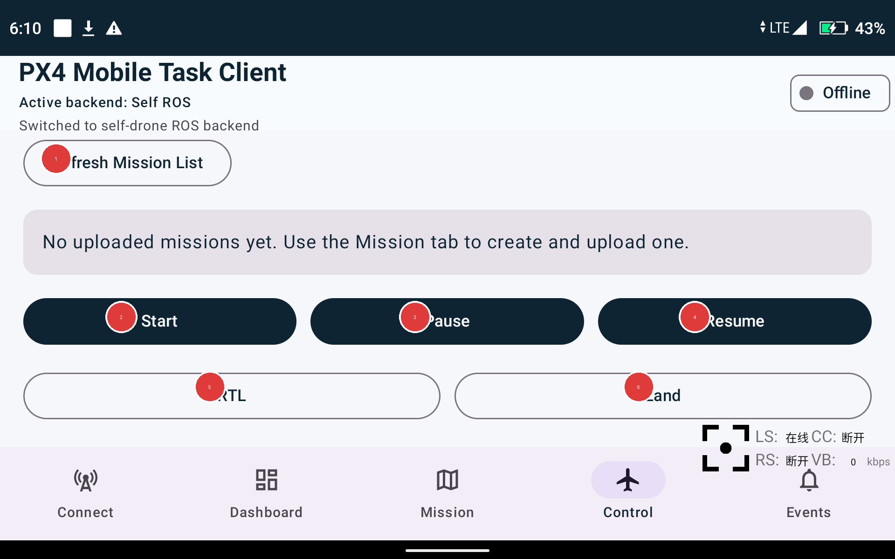
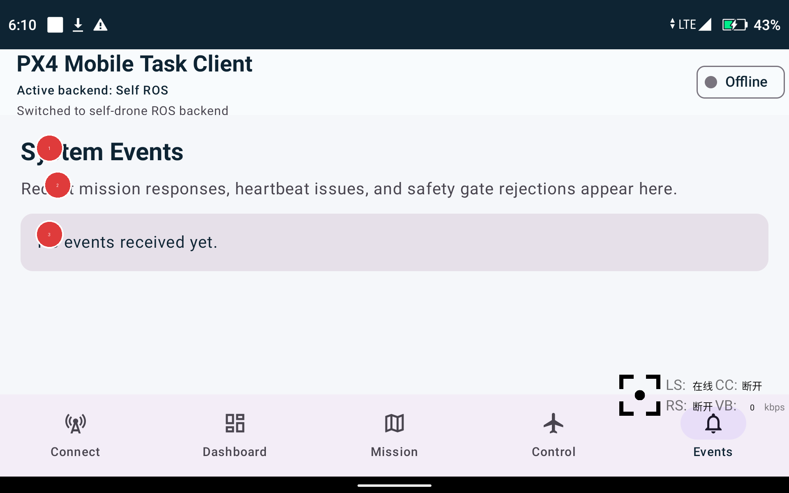
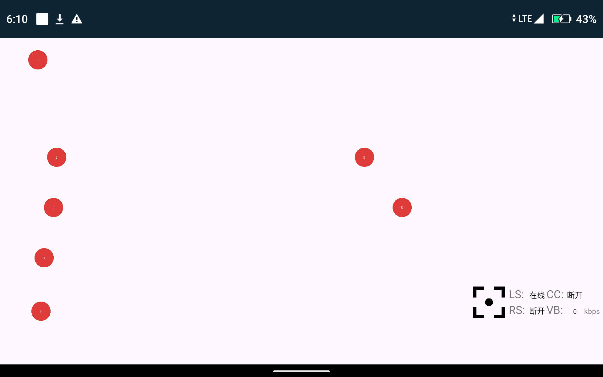

# Android App 培训版说明书

适用工程：`D:\ROS2Android\android-app\DJI-App`

适用对象：操作员、测试人员、联调人员。

目标：帮助使用者快速理解 5 个主页面、每个主要按钮的作用，以及 DJI / ROS 两条链路的基本操作方式。

## 1. 主界面总览

应用底部固定有 5 个页面入口：

- `Connect`：选择飞机后端并建立连接。
- `Dashboard`：查看当前状态和基础遥测。
- `Mission`：编辑航点、上传任务。
- `Control`：启动、暂停、返航、降落等任务控制。
- `Events`：查看系统事件和任务反馈。

应用顶部固定显示：

- 当前后端类型
- 当前状态消息
- 右上角连接状态标签

说明：右上角状态标签除了显示连接状态外，还支持长按进入隐藏的开发面板，详见开发调试文档。

## 2. Connect 页面

### 2.1 页面总览

编号说明：

1. 应用标题区：显示应用名称。
2. 当前后端状态：显示当前使用的是 `Self ROS` 还是 `DJI MSDK`。
3. 连接状态标签：显示 `Offline / Connecting / Connected / Failed`。
4. `Self ROS` 选择器：切换到自研无人机 ROS 链路。
5. `DJI MSDK` 选择器：切换到 DJI MSDK 链路。
6. 底部导航栏：切换到其他页面。

操作步骤：

1. 先确认当前要控制的是自研无人机还是 DJI 无人机。
2. 在 `Self ROS` 和 `DJI MSDK` 之间切换后端。
3. 再向下滚动，执行连接或初始化操作。

常见错误：

- 后端选错：会导致后续按钮发送到错误链路。
- 只切换了后端，没有继续点连接/初始化按钮。

### 2.2 Self ROS 连接操作区

编号说明：

1. `Host / IP`：ROS 上位机或 `rosbridge` 的 IP 地址。
2. `Port`：`rosbridge` 端口，默认通常为 `9090`。
3. `Connect`：连接 ROS 通道。
4. `Disconnect`：断开 ROS 通道。
5. `Sync Missions`：从 ROS 侧同步当前任务列表。

操作步骤：

1. 输入自研无人机上位机的 `Host / IP`。
2. 检查 `Port` 是否正确。
3. 点击 `Connect`。
4. 连接成功后，可点击 `Sync Missions` 拉取任务列表。

常见错误：

- IP 地址错误：会导致连接失败。
- ROS 侧 `rosbridge` 未启动：会一直离线或失败。

### 2.3 DJI 模式页面

编号说明：

1. 当前后端状态已切到 `DJI MSDK`。
2. `DJI MSDK` 选择器处于选中状态。
3. 右上角连接状态：DJI 初始化和产品连接状态会在这里变化。
4. DJI 后端卡片入口：向下滚动可看到机型选择、权限状态和初始化操作区。

操作步骤：

1. 点击 `DJI MSDK` 切换到 DJI 模式。
2. 向下滚动到 DJI 后端配置区。
3. 授权定位和蓝牙权限。
4. 选择机型，点击 `Init DJI`。

向下滚动后会看到的关键控件：

- `Auto / M400 / Matrice 4`：目标机型选择。
- `Grant DJI Permissions`：申请 DJI 所需定位和蓝牙权限。
- `Init DJI`：初始化 DJI SDK。
- `Disconnect`：断开 DJI 侧当前链路。
- `Refresh State`：刷新 DJI 当前任务和状态摘要。

常见错误：

- 没有授予定位/蓝牙权限。
- DJI Developer Center 的 `Package Name` 与应用 `applicationId` 不一致。
- 首次 `registerApp` 时遥控器未联网。

## 3. Dashboard 页面

编号说明：

1. `Mode`：当前飞行模式。
2. `Mission`：当前任务状态。
3. `Battery`：电量百分比。
4. `Voltage`：电池电压。
5. 底部 `Dashboard` 标签：表示当前所在页面。

操作步骤：

1. 打开 `Dashboard` 页面查看当前基本状态。
2. 重点关注 `Mode / Mission / Battery / Voltage` 是否合理。
3. 在 ROS 模式下可看到 ROS 遥测；在 DJI 模式下会尽量展示统一后的当前飞机状态。

常见错误：

- 未建立连接时，很多读数会显示默认值。
- DJI 未连接时，不应把空坐标和零值误判为真实状态。

## 4. Mission 页面

### 4.1 任务画布总览

编号说明：

1. `Mission Planner`：任务规划页面标题。
2. 页面提示文本：说明当前任务将走 ROS 还是 DJI 链路。
3. `Mission Canvas`：用于显示当前航点草图、当前飞机位置和 Home 点的简易画布。

操作步骤：

1. 先确认当前后端。
2. 在任务画布上确认大致路线。
3. 再向下编辑任务 ID 和航点。

常见错误：

- 只看画布，不检查后端类型。
- DJI 机型不支持时强行上传任务。

### 4.2 任务编辑和上传

编号说明：

1. `Mission ID`：当前任务编号。
2. `Add Waypoint`：新增一个空航点。
3. `Import Current Position`：把当前飞机经纬度一键导入为新航点。
4. `Upload Mission`：上传当前草稿任务。
5. `Waypoint 1` 区域：编辑单个航点的经纬度、高度、停留和航向。

操作步骤：

1. 填写或确认 `Mission ID`。
2. 需要新点位时，点击 `Add Waypoint`。
3. 如果要把当前飞机位置直接加入任务，点击 `Import Current Position`。
4. 检查每个航点参数。
5. 点击 `Upload Mission`。

`Import Current Position` 的行为：

- 会自动新增一个航点。
- 新航点的 `Latitude / Longitude` 使用当前飞机坐标。
- `Altitude / Hold / Yaw` 复制最后一个已有航点；如果没有可复制航点，则使用默认模板值。

常见错误：

- 当前飞机没有有效经纬度时，导入会失败。
- 任务 ID 为空时，无法上传。
- 航点经纬度格式错误时，无法上传。

## 5. Control 页面

编号说明：

1. `Refresh Mission List` / `Refresh Mission State`：刷新任务列表或 DJI 任务状态。
2. `Start`：启动任务。
3. `Pause`：暂停任务。
4. `Resume` 或 `Stop`：ROS 模式下为恢复；DJI 模式下为停止。
5. `RTL`：返航。
6. `Land`：降落。

操作步骤：

1. 先确认已有任务被选中。
2. 点击 `Start` 启动任务。
3. 需要中断时，点击 `Pause`。
4. ROS 模式需要恢复时点击 `Resume`；DJI 模式需要终止时点击 `Stop`。
5. 紧急返航使用 `RTL`。
6. 需要就地落地时使用 `Land`。

常见错误：

- 未选中任务就直接点击控制按钮。
- 把 `Resume` 和 `Stop` 的后端差异混淆。

## 6. Events 页面

编号说明：

1. `System Events`：事件页标题。
2. 说明文本：提示这里会显示任务反馈、心跳异常和安全门控信息。
3. 事件列表区域：当前没有事件时会显示空状态。

操作步骤：

1. 执行连接、上传、启动、暂停等操作后，回到 `Events` 查看结果。
2. 如果任务失败、心跳异常或被安全门控拦截，优先看这里的反馈。

常见错误：

- 只看顶部状态消息，不看事件列表。
- 遇到失败不记录事件内容，导致后续排查困难。

## 7. 开发面板

编号说明：

1. `Developer Panel` 标题：隐藏式调试页面。
2. `Refresh Snapshot`：刷新当前诊断快照。
3. `Copy Diagnostic Summary`：复制当前状态摘要。
4. `Copy Recent Logs`：复制最近应用内调试日志。
5. `Clear Logs`：清空应用内调试日志。
6. `Close Developer Panel`：关闭开发面板。
7. `App Identity` 卡片：查看 `applicationId`、版本号和当前后端等基础身份信息。

操作步骤：

1. 长按右上角连接状态标签进入开发面板。
2. 先看 `App Identity / ROS Status / DJI Status / Position and Home / Permissions and Mission`。
3. 如需反馈问题，优先复制 `Diagnostic Summary` 和 `Recent Logs`。

常见错误：

- 只看系统 `logcat`，忽略应用内诊断摘要。
- 清空日志前没有先复制证据。

## 8. 推荐操作流程

### 8.1 自研无人机 ROS 链路

1. 进入 `Connect`。
2. 选择 `Self ROS`。
3. 输入 `Host / IP` 和 `Port`。
4. 点击 `Connect`。
5. 点击 `Sync Missions`。
6. 在 `Mission` 页面编辑并上传任务。
7. 在 `Control` 页面启动、暂停、恢复、返航或降落。

### 8.2 DJI 无人机 MSDK 链路

1. 进入 `Connect`。
2. 选择 `DJI MSDK`。
3. 授权定位/蓝牙权限。
4. 选择目标机型。
5. 点击 `Init DJI`。
6. 在 `Mission` 页面编辑任务，必要时使用 `Import Current Position`。
7. 上传任务后，在 `Control` 页面启动、暂停、停止、返航或降落。

## 9. 当前版本限制

- 模拟器主要用于编译和基础界面验证，不用于真实 DJI 飞机连接验证。
- `Matrice 4 Series` 当前仍处于受限状态，等待最终 `WaylineDroneType` 确认。
- `Import Current Position` 依赖当前后端能提供有效经纬度；如果没有真实坐标，按钮会失败并给出提示。
